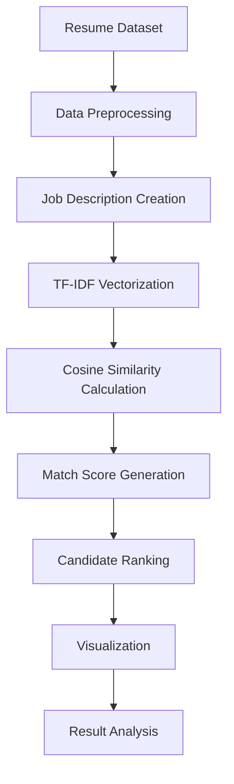

# 📄 RESUME SCREENING & CANDIDATE RANKING SYSTEM


---

## 📌 PROJECT OVERVIEW

Recruitment teams often receive hundreds of resumes for a single job opening. Manually reviewing every application is time-consuming and can lead to inconsistencies in candidate evaluation.

This project implements a **Resume Screening and Candidate Ranking System** using **Natural Language Processing (NLP)** techniques. The system compares candidate skills with a predefined job description and calculates a match score based on textual similarity.

By analyzing the skills listed in resumes, the model identifies the most suitable candidates and ranks them according to their relevance to job requirements.

The project uses:

✅ TF-IDF Vectorization

✅ Cosine Similarity Scoring

✅ Skill Matching

✅ Candidate Ranking

✅ Data Visualization

This approach simulates the functionality of modern Applicant Tracking Systems (ATS) used by organizations during recruitment.

---

## 📖 TABLE OF CONTENTS

* 📌 Project Overview
* 🎯 Objectives
* 📊 Dataset Information
* 🛠️ Technology Stack
* 🔄 Project Workflow
* 🧹 Data Preprocessing
* 🔍 Feature Engineering
* 🤖 Similarity Scoring
* ✨ Key Features
* 📈 Results
* 📊 Visualizations
* 📁 Project Structure
* ▶️ Usage
* 💼 Business Benefits
* 🔮 Future Enhancements
* 🏁 Conclusion
* 👩‍💻 Author

---

## 🎯 OBJECTIVES

🎯 Automate the resume screening process.

🎯 Compare candidate skills with job requirements.

🎯 Calculate match scores for each applicant.

🎯 Rank candidates based on suitability.

🎯 Reduce manual screening effort.

🎯 Improve recruitment efficiency.

🎯 Visualize candidate performance using charts.

---

## 📊 DATASET INFORMATION

| Attribute          | Details                       |
| ------------------ | ----------------------------- |
| 📄 Dataset Type    | Resume Dataset                |
| 👥 Candidates      | Multiple Applicants           |
| 🎯 Target Output   | Match Score & Ranking         |
| 📋 Input Fields    | Candidate Skills, Resume Text |
| 💼 Job Requirement | Job Description               |

### Features Included

* 👤 Candidate Name
* 📄 Resume Content
* 🛠 Skills
* 💼 Job Description
* 📊 Match Score
* 🏆 Candidate Rank

---

## 🛠️ TECHNOLOGY STACK

| Technology           | Purpose                   |
| -------------------- | ------------------------- |
| 🐍 Python            | Core Programming Language |
| 🐼 Pandas            | Data Processing           |
| 🔢 NumPy             | Numerical Computation     |
| 🤖 Scikit-Learn      | Machine Learning          |
| 📊 Matplotlib        | Data Visualization        |
| 📓 Jupyter Notebook  | Development Environment   |
| 💬 NLP               | Text Processing           |
| 🔍 TF-IDF Vectorizer | Feature Extraction        |
| 📈 Cosine Similarity | Candidate Matching        |

---

## 🔄 PROJECT WORKFLOW



### Workflow Steps

📥 Data Collection and Loading

🧹 Resume Data Preprocessing

💼 Job Description Creation

🔍 TF-IDF Vectorization

📈 Similarity Score Calculation

🏆 Candidate Ranking

📊 Visualization

📋 Result Analysis

---

## 🧹 DATA PREPROCESSING

The resume data undergoes several preprocessing steps:

✅ Missing Value Handling

✅ Lowercase Conversion

✅ Text Cleaning

✅ Special Character Removal

✅ Stopword Removal

✅ Text Normalization

These preprocessing techniques improve the quality of textual data before similarity analysis.

---

## 🔍 FEATURE ENGINEERING

### TF-IDF Vectorization

TF-IDF (Term Frequency-Inverse Document Frequency) converts textual resume content into numerical vectors.

### Benefits

✔️ Identifies important keywords

✔️ Captures skill relevance

✔️ Reduces impact of common words

✔️ Improves candidate matching accuracy

---

## 🤖 SIMILARITY SCORING

### Cosine Similarity

The project uses **Cosine Similarity** to compare resumes against the job description.

### Process

📄 Resume Text → TF-IDF Vector

💼 Job Description → TF-IDF Vector

📊 Similarity Score Calculation

🏆 Candidate Ranking

Higher similarity scores indicate a stronger match between candidate skills and job requirements.

---

## ✨ KEY FEATURES

✅ Automated Resume Screening

✅ Candidate Ranking System

✅ Skill Matching

✅ TF-IDF Vectorization

✅ Cosine Similarity Scoring

✅ Match Score Calculation

✅ NLP-Based Candidate Evaluation

✅ Data Visualization

✅ ATS Simulation

✅ Recruiter-Friendly Analysis

---

## 📈 RESULTS

The system successfully:

✔️ Screens resumes automatically

✔️ Compares candidate skills with job requirements

✔️ Calculates match percentages

✔️ Generates candidate rankings

✔️ Identifies top-performing applicants

---

## 📊 VISUALIZATIONS

### 📈 Candidate Match Score Distribution

📷 Screenshot Placeholder

```text
assets/match_score_distribution.png
```

### 📊 Candidate Ranking Chart

📷 Screenshot Placeholder

```text
assets/candidate_ranking.png
```

---

## 📁 PROJECT STRUCTURE

```text
FUTURE_ML_02
│
├── 📂 data
│   └── resumes.csv
│
├── 📂 notebooks
│   └── Resume_Screening.ipynb
│
├── 📂 assets
│   ├── match_score_distribution.png
│   └── candidate_ranking.png
│
├── requirements.txt
│
└── README.md
```


---

## 💼 BUSINESS BENEFITS

⚡ Faster Resume Screening

⚡ Reduced Recruitment Effort

⚡ Improved Candidate Selection

⚡ Objective Candidate Evaluation

⚡ Enhanced Hiring Efficiency

⚡ Better Talent Acquisition Process

⚡ Data-Driven Recruitment Decisions

⚡ ATS-Like Candidate Ranking

---

## 🔮 FUTURE ENHANCEMENTS

🚀 Deep Learning-Based Resume Analysis

🚀 BERT-Based Candidate Matching

🚀 Resume Parsing Automation

🚀 Real-Time Recruitment Dashboard

🚀 Multi-Language Resume Support

🚀 Job Recommendation System

🚀 Web Application Deployment

🚀 AI-Powered Interview Shortlisting

---

## 🏁 CONCLUSION

This project demonstrates the practical application of **Natural Language Processing (NLP)** and **Machine Learning** in recruitment and talent acquisition.

By automating resume screening and candidate ranking, organizations can reduce manual effort, improve hiring efficiency, and identify the most suitable candidates quickly and accurately.

The project serves as a real-world example of how NLP can streamline recruitment workflows and support data-driven hiring decisions.

---

## 👩‍💻 AUTHOR

### Devika S

---

### ⭐ If you found this project useful, don't forget to star the repository!
